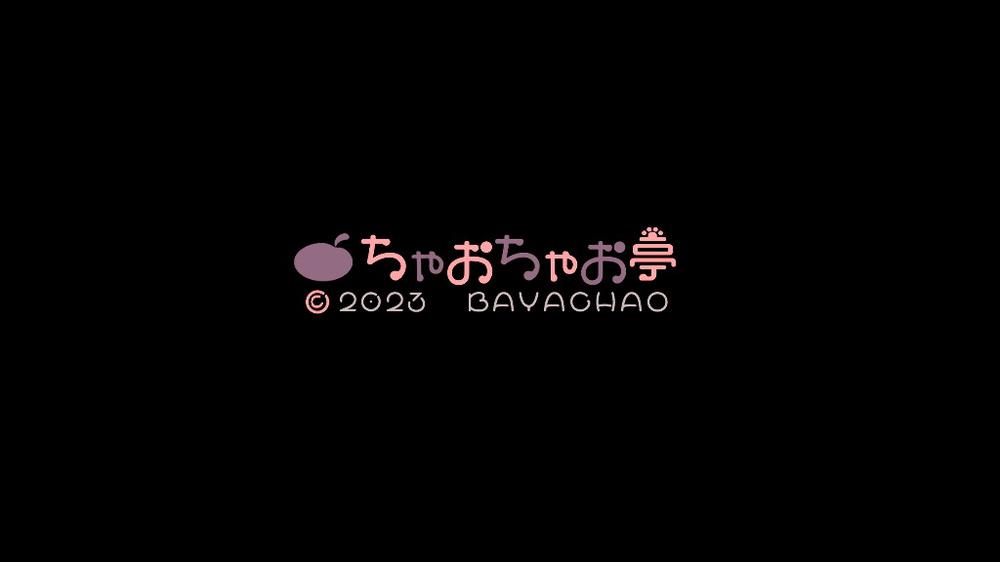

# Shattered Pixel Dungeon + (SPD-Kohaku)

> **Cảnh báo bản quyền** — Bất kì khiếu nại bản quyền nào sẽ dẫn đến việc dự án bị đóng cửa và xoá bỏ nội dung liên quan.

**Website**: [tonn5698-glitch.github.io/SPD-Kohaku-Web](https://tonn5698-glitch.github.io/SPD-Kohaku-Web/)

Thank you for your attention to my project. 

--Ton--

[Shattered Pixel Dungeon](https://shatteredpixel.com/shatteredpd/) is an open-source traditional roguelike dungeon crawler with randomized levels and enemies, and hundreds of items to collect and use. It's based on the [source code of Pixel Dungeon](https://github.com/00-Evan/pixel-dungeon-gradle), by [Watabou](https://watabou.itch.io/).

Shattered Pixel Dungeon currently compiles for Android, iOS, and Desktop platforms. You can find official releases of the game on:

If you like this game, please consider [supporting me on Patreon](https://www.patreon.com/ShatteredPixel)!

There is an official blog for this project at [ShatteredPixel.com](https://www.shatteredpixel.com/blog/).

The game also has a translation project hosted on [Transifex](https://explore.transifex.com/shattered-pixel/shattered-pixel-dungeon/).

Note that **this repository does not accept pull requests!** The code here is provided in hopes that others may find it useful for their own projects, not to allow community contribution. Issue reports of all kinds (bug reports, feature requests, etc.) are welcome.

If you'd like to work with the code, you can find the following guides in `/docs`:
- [Compiling for Android.](docs/getting-started-android.md)
    - **[If you plan to distribute on Google Play please read the end of this guide.](docs/getting-started-android.md#distributing-your-app)**
- [Compiling for desktop platforms.](docs/getting-started-desktop.md)
- [Compiling for iOS.](docs/getting-started-ios.md)
- [Recommended changes for making your own version.](docs/recommended-changes.md)
